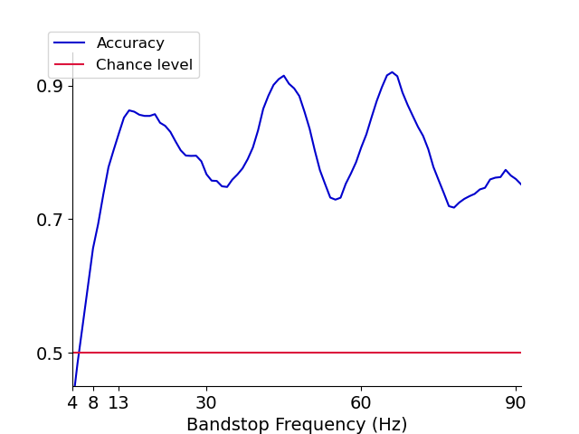

# DBS-s-EEGNet

This repository was created to support the publication **Deep Learning-Driven EEG Analysis for Personalized Deep Brain Stimulation Programming in Parkinson's Disease** *(Calvo Peiro et al., 2024)*. It includes the *DBS-s-EEGNet* model implemented in PyTorch, as well as a training pipeline and the post-hoc ablation explainability methods. The code presented here is ready to be deployed with EEG data and labels. This code was developped by Nicolas Calvo Peiro & Mathias Ramm Haugland, and is now maintained by Nicolas Calvo Peiro (nc619@ic.ac.uk).

The *DBS-s-EEGNet* architecture is a siamese adaption of the EEGNet architecture *(Lawhern et al., 2017)* created to discriminate the changes in brain activity when changing DBS parameters. 

In this repository, you will find the code for the *DBS-s-EEGNet* model, the training pipeline (includes hyperparameter tuning), and the post-hoc ablation explainability methods. The preprocessing pipeline of our specific dataset is not included here, since the dataset is not publicly available.

Since the pair generation code is specific to our dataset and annotations, it is **not** included here. Since pair generation involves combination of segments, it requires careful attention to the train/test/val split. To use this code off the shelf, you will **need to implement your own pair generation code, and your own data splitting**, into a train/test split. The code offers validation splitting through folds, but feel free to adapt it if you want your validation split to be combinations-aware.

Your data should be either contained in a data.mat file, with the variables `X_train, y_train, X_test, y_test` or in 4 .npy files, with the variables `X_train, y_train, X_test, y_test`. Our code does the train/val split for you, including the option to do a k-fold cross-validation. This is decided in the main.py file, where you can change the input parameters to choose this. A more detailed explanation of the input parameters can be found below in the [Input Parameters](#input-parameters) section.


Here is a visual representation of the *DBS-s-EEGNet* architecture and the post-hoc ablation explainability methods:

<div align="center">

</div>

With this pipeline, we achieved an overall accuracy of 78.24% in the classification task of discriminating the changes in brain activity when changing DBS parameters across 4 patients.

With the post-hoc ablation explainability methods, we were able to identify the frequency bands that were most important for the classification task. Examples of the figures you can expect with this code are the following:

<div align="center">

</div>

Note: this figure is with the random data example provided, for an example of how the figures would look like with real data go check the publication (*Calvo Peiro et al., 2024*)

Below you will find more info on the code, indicating how to use this code with your own data and explaining the structure of the repository in detail.
If you find any errors with the code or have any compatibility issues, please raise an issue on github and we will do our best to assist you.


## Contents
- [Quickstart](#quickstart)
    - [Setup](#setup)
    - [Your EEG Data](#your-eeg-data)
    - [Input Parameters](#input-parameters)
    - [Running the code](#running-the-code)
- [Repository Structure](#repository-structure)
    - [Script Structure](#script-structure)
    - [Folder Structure](#folder-structure)
- [Outputs](#outputs)
    - [Main Outputs](#main-outputs)
    - [Additional Outputs](#additional-outputs)
- [Pipeline Overview](#pipeline-overview)
    - [Script Flow](#script-flow-full_run-mode)
    - [1. Hyperparameter Tuning](#1-hyperparameter-tuning)
    - [2. Training (K-fold cross validation)](#2-training-k-fold-cross-validation)
    - [3. Testing and ablation analysis](#3-testing-and-ablation-analysis)
- [How to contribute](#how-to-contribute)
- [Example Uses](#example-uses)


## Quickstart
### Setup
To get started, we recommend using a dedicated Python environment (such as one created with [Anaconda](https://www.anaconda.com/download)). Enter the repository folder and run the code below to set up the environment and install dependencies (if you use anaconda):

```bash
conda env create -f environment.yml
conda activate dbs-s-eegnet
```
In the environment.yml file, there are multiple cuda dependencies. If you do not have a cuda-capable GPU, you can remove them.

For the training pipeline, we strongly recommend using a GPU. Even if the models are shallow, EEG data is high-dimensional, and deep-learning models are computationally expensive.

If you do not use anaconda, feel free to inspect the environment.yml file, which is easy to read and just contains the required dependencies/packages to install in python.

### Your EEG Data
With the code provided here, you can easily adapt it to your own EEG data. The only requirement is that your EEG data is of shape (n_channels, n_samples, 2), where the last dimension corresponds to the fact that there are two pairs of EEG segments. Your labels should be an array of shape (n_samples,) where each label is an integer indicating whether the EEG segments belong to the same DBS parameter or not (0 or 1).

### Input Parameters
This repository is very dependent on the correct choice of input parameters inside the main.py script. Setting these correctly will allow you to fit the code to your desired behaviour. 

Below you can find a list of all input parameters, including a description of what they do, a list of possible values, and a recommended default value. These input parameters are also commented inside the main.py script, but the description below is more extensive:

```python
study_name: str 
# ┗ default = "example_study"
# ┗ The name of your study. All outputs of the code will be saved under a folder called study_name. You can do multiple runs within a study in parallel, and they will be combined.

folder: str
# ┗ default = "DBS-s-EEGNet"
# ┗ The path (relative or absolute) to the repository. If you are already in the repository folder, you can leave it empty. If you give a relative path, this is transformed to an absolute path in the code itself.

data_folder: str
# ┗ default = f"{folder}/your_data"
# ┗ The path to your data folder.

mode: str
# ┗ default = "full_run"
# ┗ Possible values: ["train", "tune", "test", "cross_val", "cross_tune", "full_run"]
# ┗ The running mode. We recommend using full_run, but other options are available for more personalised use/debugging. "train", "tune" or "test" will run only the specific sub-sections of the code detailed by the names. For more info on what each do, go see the Pipeline Overview section. "cross_val" and "cross_tune" are same as tune and train but with K-folds cross-validation. The "full_run" mode runs the whole pipeline, using K-folds cross-validation.

load_mode: str
# ┗ default = "numpy"
# ┗ Possible values: ["numpy", "matlab"]
# ┗ Whether your data is saved as .npy or .mat files.

noise: float
# ┗ default = 0.01
# ┗ Noise (in terms of relative standard deviation) to add to your EEG data. Can be left to 0.

chan_to_exclude: list[int]
# ┗ default = []
# ┗ The indices of the channels to exclude (for now these are excluded only by setting them to 0)

channel_rescaling: bool
# ┗ default = True
# ┗ Whether to rescale your channels to have a mean of 1 (rescaling is done across the whole EEG, not per channel)

runs: list[int]
# ┗ default = []
# ┗ This is for testing. For training, your script will give all your outputs under the runX folders. Where X indicates the number of the parallel run. By setting runs, you can choose which ones are analysed in testing. If you leave it empty and have it as mode="full_run", this will be automatically set.
 
default_nruns: int
# ┗ default = 5
# ┗ Default number of parallel runs to do (i.e. number of runs done in full_run mode). 

epochs: int
# ┗ default = 450
# ┗ Number of training epochs per fold

sample_freq: int
# ┗ default = 300
# ┗ The sampling frequency of your EEG data in Hz

save_model: bool
# ┗ default = True
# ┗ Whether to save the model at chosen checkpoints or not. Even if False, the best model per fold is saved.

checkpoints: list[int]
# ┗ default = []
# ┗ At which epochs to save checkpoints if save_model = True. If set to empty, only the best epoch in terms of validation performance is saved

batch_size: int
# ┗ default = 64
# ┗ Batch size (in terms of pairs) for training

class_labels: list[str]
# ┗ default = ['Same', 'Different']
# ┗ Labels for the classes (only useful for plotting in confusion matrix)

tune_multifold: bool
# ┗ default = True
# ┗ Whether to tune the hyperparameters across multiple folds or not. We recommend setting this to True.

epoch_verbose: bool
# ┗ default = False 
# ┗ Whether you will get a progression bar for the epochs printed in the terminal.

tune_verbose: bool
# ┗ default = False 
# ┗ Whether all tune outputs will be printed to the terminal. Because of the way Ray Tune works, even if set to False, you will have some outputs shown to the terminal.

save_verbose: bool
# ┗ default = True
# ┗ Whether, when a file is saved, this will be printed to the terminal.

test_verbose: bool
# ┗ default = False 
# ┗ Whether to print all the testing outputs or not. If set to False, you will get the accuracy printed anyways. 

dataset_verbose: bool
# ┗ default = False
# ┗ Whether to print the validation set size and balancing. (This is printed at every fold).

metric: str
# ┗ default = 'loss' 
# ┗ Possible values: ['loss', 'acc']
# ┗ Whether to use the validation accuracy or validation loss to choose which epoch had the best model. We recommend using loss

run_comb: bool
# ┗ default = True 
# ┗ Whether to run the combination of runs in testing. NOTE: you will need to run it at least once, but we give the option to turn it off here, since if you do a lot of debugging running it many times might take time and resources for nothing.

fold_select: bool
# ┗ default = True
# ┗ Whether to select the top 75% of folds in terms of validation performance (unless they have 80% accuracy, then they are not discarded). This is further detailed in the paper.

num_cpus: int/None
# ┗ default = None 
# ┗ Number of cpus to use for the tuning process. If left to None, these will be automatically allocated by the code (we are not taking all of them).

use_tune: bool
# ┗ default = True
# ┗ Whether to load the hyperparameters from the tuning phase and use them for training/testing. If set to False, the parameters under base_params will be used (see base_params further below)

tune_folder: str
# ┗ default = ""
# ┗ The sub-sub-folder inside the ray_results sub-folder (see the folder structure above) in which your tuning results will be saved. If set to empty, this will default to study_name.

test_modes: list[str]
# ┗ default = ['BS','BP','HP','LP']
# ┗ Possible Values: 'BS', 'BP', 'HP', 'LP' 
# ┗ Which filtering modes to do for the ablation analysis. These stand for bandstop, bandpass, highpass, and lowpass filtering respectively. In the paper, BS is used.

save_format: str
# ┗ default = "png"
# ┗ Possible Values: "png", "svg", "jpg", etc...
# ┗ Which format to save all the figure outputs in (use "svg" for vector graphics)

n_folds: int
# ┗ default = 10
# ┗ Number of folds to do per run

val_bal_ratio: float
# ┗ default = 0.5
# ┗ Ratio of balancing in the validation data. If set to 0.5, there is a 1:1 ratio of classes. 

val_size: int
# ┗ default = 20
# ┗ Number of samples in the validation dataset. If you want the k-folds to work normally, set val_size = int(X_train.shape[0]/n_folds) 

base_params: dict[str: int/float]
┗ 'L1': float # The L1 penalty applied to the loss 
┗ 'fc_dropout': float # The dropout rate of the fully-connected layers
┗ 'conv_dropout': float # The dropout rate of the convolutional filters
┗ 'D': int # Number of spatial filters to use
┗ 'F1': float # Number of temporal filters to use
┗ 'L2': float # The L2 penalty applied to the loss
┗ 'lr': float # The learning rate for backpropagation 

config: dict[str: tune_distribution]
# ┗ The keys can be any from the base_params dictionary. The elements inside each dictionary key should be either a list of possible values (not recommended), or a ray.tune distribution, such as ray.tune.loguniform(start, stop). It is recommended to look at the default value in main.py and the ray.tune.loguniform documentation to understand how this samples the hyperparameters. Non-log distributions are available.

tune_params: dict[str: int/str]
┗ 'num_samples': int # The number of random points for tuning process 
┗ 'metric': str # The metric used to optimise the hyperparameters. Choose between "val_loss", "val_acc", "train_loss", and "train_acc". default = "val_loss"
┗ 'mode': str # Maximise or minimise metric. Choose between "min" or "max"
┗ 'grace_period': int # Minimum number of epochs before stopping a tuning trial
┗ 'reduction_factor': int # Reduction factor of the HyperBand scheduler (higher means trials will be stopped more harshly)
```
Other input parameters that are set based on your input data, but you could manually change them:
```python
seg_dur: float # duration of each segment in seconds
seg_len: int # length of each segment in samples
n_channels: int # number of EEG channels per segment
```

### Running the code:
To run the code, you should set all your input parameters, and run the main.py script. We recommend that you first run using `mode="full_run"`, and then when you are more familiar with the code, you can start debugging/adapting it using other modes. 

It is very important that you set your folder variables correctly, being aware of which folder your terminal is in when running the code. If using something like VSCode, you can just press run on the main.py script. With the command line, you can write it as:
```bash
python main.py
```


## Repository Structure

### Script Structure
Below you will see what each script does, and the flow of the script calls:
- <ins> main.py</ins> : This is the main script, where you set all your input parameters, and is the one you should press run on. Here, the data is loaded, and some light preprocessing is done to it, the rest is just setting input parameters.
- <ins> dbs_s_eegnet.py</ins> : This script has the PyTorch implementation of the DBS-s-EEGNet, it has additional inputs to allow for hyperparameter tuning.
- <ins> tune.py</ins> : This script handles the hyperparameter tuning of the models, through the ```myTune()``` function. In this function, all the tuning variables are initialised, the tuning is run, and the tuning outputs are saved.
- <ins> tune_utils.py</ins> : This has all the functions supporting the tuning process (i.e. functions called inside ```myTune()```).
- <ins> train.py</ins> : This script handles the training of the models, through the `myTrain()` function. In it, all the required output folders are created, the data is split into train/val folds, the models are created and trained for each epoch. The results and plots are then saved at the end of the function. 
- <ins> train_utils.py</ins> : This script has a number of functions that all handle the steps inside the train.py script.
- <ins> test.py</ins> : This script handles the testing of the models, through the `myTest()` function. Here, the different parallel runs are combined, the evaluation is done, and the ablation analysis is also performed. The required output folders are created, and the outputs are saved.
- <ins> test_utils.py</ins> : This script has a number of functions that all handle the steps inside the test.py script.

The flow of the scripts can be seen below:
<div align="center">

</div>

### Folder structure
```
📂 DBS-s-EEGNet
┗ 📂 assets -> contains images for the readme file (you can ignore)
┗ 📂 outputs
┃       ┗ 📂 example_study -> Example output
┃               ┗ 📂 plots
┃               ┃       ┗ 📂 fullrun_1_2_3_4_5
┃               ┃       ┃       ┗ loss_acc_BP_4.0_to91.0.png -> Bandpass plot
┃               ┃       ┃       ┗ loss_acc_BS_4.0_to91.0.png -> Bandstop plot
┃               ┃       ┃       ┗ loss_acc_HP_4.0_to91.0.png -> Highpass plot
┃               ┃       ┃       ┗ loss_acc_LP_4.0_to91.0.png -> Lowpass plot
┃               ┃       ┃       ┗ testconfmat_fALL.png -> Confusion Matrix
┃               ┃       ┗ tune_plot.png
┃               ┗ 📂 ray_results
┃               ┗ 📂 results -> Contains per-epoch plots & numerical results
┃                       ┗ 📂 fullrun_1_2_3_4_5 -> Combines all parallel runs
┃                       ┗ 📂 run1
┃                       ┗ 📂 run2
┃                       ┗ 📂 run3
┃                       ┗ 📂 run4
┃                       ┗ 📂 run5
┗ 📂 your_data
┃       ┗ 📂 example_data -> Random data used in example output
┃               ┗ X_test.npy
┃               ┗ X_train.npy
┃               ┗ y_test.npy
┃               ┗ y_train.npy
┗ dbs_s_eegnet.py
┗ environment.yml
┗ main.py
┗ test.py
┗ test_utils.py
┗ train.py
┗ train_utils.py
┗ tune.py
┗ tune_utils.py
```
## Outputs
This section details all the outputs from using the scripts in the repository. Below you will find the main outputs, and then another section detailing the additional outputs. The main outputs are outputs you will most likely want to check and use, whereas the additional outputs are outputs that can be used for further development and debugging.

### Main Outputs
1. The plot outputs from testing will be saved under the outputs/study_name/plots/fullrun_X_X_X_X folder (see folder structure above with the example_study folder to understand if this is confusing). Here you will have a plot for each filtering mode, that shows the ablation analysis, similarly to the paper
3. Additionally, you will have the confusion matrix plot across all folds and runs.
2. There is a plot output from tuning, which is saved under plots and is called "tune_plot.png" in the outputs/study_name/plots/ folder. This image contains a series of subplots, each showing the accuracy vs hyperparameter scatter plot.
4. In terms of numerical outputs, these will be stored under the outputs/study_name/results/ folder. Under the fullrun_X_X_X_X subfolder, you will find the band_drop_results.csv file. This contains the accuracy drop per frequency band filtered, similarly to what is shown in the paper.
5. The overall accuracy can be seen as the title of the confusion matrix plot (see Output 1.), or can be extracted again from the additional outputs (read below). 

### Additional outputs
On top of the main outputs, there are many other outputs which are useful for debugging and/or further development. 
1. Inside the outputs/study_name/ray_results/ folder, you will have the raw Ray Tune outputs, which you can use for further development or checking of errors (you need to familiarise yourself with the Ray Tune output structure first). 
2. Inside the outputs/study_name/results/runX/ folder, you will have accuracy and loss vs epochs plots for each fold. These can be useful to gain further insight into your model's training behaviour.
3. Inside the outputs/study_name/results/runX/ folder, you will have multiple .csv outputs, which keep the validation and train accuracies, losses, and indices (to split train/val) for every fold.
4. Inside the outputs/study_name/results/runX/ folder, you will have the params.json file, which keeps all the input parameters and can be loaded using the json package in Python. 
5. Inside the outputs/study_name/results/fullrun_X_X_X_X/ folder, you will find the best model for each fold. These can also be found for under the outputs/study_name/results/runX folder, where you will also see the additional checkpoints if you decided to add some.
6. Inside the outputs/study_name/results/fullrun_X_X_X_X/ folder, you will find filter_array_XX.npy files, where XX corresponds to the filtering mode, and these contain the numerical values used for the ablation analysis plots
7. Inside the outputs/study_name/results/fullrun_X_X_X_X/ folder, you will find the full_results.npy and the heat_results file, which contain results from testing that can be used for further development (use the test.py and test_utils.py code to see what exactly is inside).
8. Inside the outputs/study_name/results/fullrun_X_X_X_X/ folder, you will find the band_histogram.json file, which has information on filtering per band, including which band affected accuracy the most, and can be used for further development (use the test.py and test_utils.py code to see what exactly is inside).

## Pipeline Overview
The repository can be fully run using the main.py script, where you will select all your input parameters. Below is an overview of the pipeline and the different running modes.

### <ins>Script Flow (```full_run``` mode)
If you decide to run the script with ```mode = full_run```, all the steps will be run at once. This is the recommended use if you just wish to run the pipeline. In this case, the flow will be as follows:

1. Hyperparameter tuning
2. K-fold cross validation training 
3. Evaluaton and ablation analysis on test data (Testing)

Below you will find a more detailed description of each step

### <ins>1. Hyperparameter Tuning
In this mode, the different hyperparameters will be tuned using the Ray Tune [REFERENCE] library with a Hyperband scheduler [REFERENCE]. In the example code, L2 penalty and learning rate are tuned, but below you can find a list of all tunable parameters:
- ```L1```: The weight of the L1 penalty 
- ```L2```: The weight of the L2 penalty
- ```fc_dropout```: The dropout rate in the fully-connected layers
- ```conv_dropout```: The dropout rate of convolutional filters
- ```lr```: Learning rate
- ```D```: Number of spatial filters
- ```F1```: Number of temporal filters


This will be run implemented by setting ``` mode = "tune" ```, ``` mode = "cross_tune" ```, or ```mode = "full_run"```.

The outputs of this step are saved as a scatter plot of the accuracy and loss for each parameter value, and the set of parameters that yielded the best results (in terms of loss or accuracy) are saved. The full tune results are also saved, but you need to be familiar with the Ray Tune library to interpret them.

#### <ins>2. Training (K-fold cross validation)
In this mode, the DBS-s-EEGNet will be created and trained, once for each fold. Whilst K-folds cross validation is recommended, and is what is done in the paper, you can also do single-fold training. The K-fold split is done for you inside the code.

This step was created with the purpose of being run in parallel across multiple runs, which  is why you have the ```n_runs``` variable. The outputs of this step are saved inside the outputs folder, under the sub-folder of whatever variable you set for ```study_name```. Inside there, you will see a results folder, that has the different runs as sub-folders. Inside each run, you can find an accuracy vs epoch and a loss vs epoch plot for each fold, saved checkpoints of the model for each fold, and train/validation indices and accuracies. See more in the [Outputs](#outputs) section.

### <ins>3. Testing and ablation analysis
In this mode, the DBS-s-EEGNet will be evaluated on the test data in multiple ways. Before that, the folds of all the different parallel runs are combined into a single sub-folder of results. In the case of having runs 1-5, this would be called fullrun_1_2_3_4_5 for example. Here the fold selection, where only the top 75% of folds (in terms of validation loss) are kept for further analysis. This can be disabled by setting ```python fold_select=False``` 
(see [Input Parameters](#input-parameters)).

The models are then evaluated in multiple ways. First, the accuracy and confusion matrix is extracted. Then, the ablation studies are done, where your EEG data is filtered in the same ways as in the publication. Here, you can choose between ```BS, BP, HP, LP``` as testing modes (or all of them at once), which stand for bandstop, bandpass, highpass, and lowpass filtering respectively (see [Input Parameters](#input-parameters))

The outputs of this step will be saved under the results and plots folders inside your study, both in the fullrun_X_X_X_X sub-folder (see [Outputs](#outputs)). In terms of plots, it will output the confusion matrix, and similar ablation plots to those found in the paper. In the results folder, it will output a table of the accuracy drop per frequency band filtered, similarly to the paper, under the band_drop_results.csv file. It will also output additional results files, which you can use for further development (see [Outputs](#outputs))

## How to contribute
If you experience any errors feel free to raise an issue in the github repository and we will do our best to help you! If you wish to collaborate with us on this, drop me an email at nc619@ic.ac.uk. If you want to make your further developments public, feel free to fork the repository, and make a pull request. If we consider it relevant, we can add it as an official branch to the repository.

## Example Uses
An example output can be found inside the outputs/example_study folder. This was generated with random data, so the results are all chance level. The purpose is to show you the outputs you can expect from running the code.

